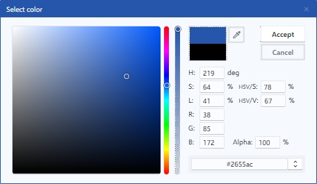

# Color dialog

El selector de colores es una herramienta que le permite seleccionar y personalizar colores de manera intuitiva y precisa. Con características como el control de brillo y la transparencia, el usuario puede ajustar el color exactamente como lo desee. Además, la función de eye dropper permite seleccionar cualquier color de la pantalla, y los valores de entrada y salida brindan una forma precisa de especificar el color deseado.

<figure><figcaption>
Color dialog
</figcaption></figure>

### 1. Color area

Controla la intensidad o brillo del color seleccionado. Este slider le permite ajustar el brillo del color en función de la cantidad de luz que desee que refleje. Cuando el manejador está en su posición más baja, el color se muestra muy oscuro y cuando se mueve hacia arriba, el color se vuelve más brillante.

### 2. Color sliders

Este slider muestra un espectro completo de colores en forma de gradiente, al deslizar el manejador en el espectro se puede seleccionar un color específico en función de su tono, saturación y brillo. El tono se refiere a la ubicación del color en el espectro y puede variar desde tonos cálidos (rojos, naranjas, amarillos) hasta tonos fríos (verdes, azules, violetas).

El slider que modifica el valor alpha controla la transparencia del color seleccionado. El valor alpha es la parte de un color que indica su opacidad o transparencia. Cuando el valor alpha es 100%, el color es completamente opaco y cuando es 0%, el color es completamente transparente.&#x20;

### 3. Color preview

Permite ver el color que ha seleccionado de manera clara y precisa, y le proporciona una referencia visual para comparar y ajustar otros colores en la composición.

### 4. Eye dropper

Al hacer clic en el botón del eye dropper, el cursor del mouse se convertirá en una lupa con un aumento que le permitirá moverlo por la ventana y seleccionar un color.

### 5. Values input

Permiten ingresar valores específicos para cada uno de los canales de color, puede ingresar valores numéricos para H, S, L, R, G, B, HSV/S, HSV/V y Alpha. Estos valores pueden ser ingresados manualmente o mediante la interacción con los controles del color picker. Los valores ingresados se reflejan en tiempo real en el color area y en el color sliders, permitiendo una selección precisa y personalizada del color.

### 6. Value output

Se muestra el código del color seleccionado como Hexadecimal, RGB, RGBA, HSL o HSLA. El formato de salida dependerá de los ajustes del color que haya realizado.
