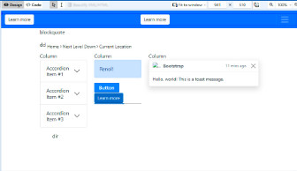

# Design Frame

El Marco de Diseño permite a los usuarios crear, editar y manipular documentos HTML y fragmentos XML de manera visual, arrastrando y soltando componentes desde la Paleta de Componentes. Además, la vista de código proporciona una forma rápida de acceder y editar el código fuente. El Marco de Diseño también ofrece diferentes opciones de ajustes del Viewport, lo que permite a los usuarios simular diferentes tamaños de pantalla y dispositivos para asegurarse de que su sitio web sea compatible con todos los tamaños de pantalla.

<figure><figcaption>
Design Frame
</figcaption></figure>

### 1. Design view

En esta vista se puede crear y manipular documentos HTML y fragmentos XML de manera visual, y utilizar la Paleta de Componentes para arrastrar y soltar componentes y elementos y ver cómo se renderizan en tiempo real.

### 2. Code view

En esta vista se puede acceder y editar el código fuente de su documento con total libertad.

### 3. Pointer mode

En este modo se interactúa con los componentes y elementos de su documento utilizando el cursor.

### 4. Text edition mode

En este modo se puede editar directamente el contenido de texto de su documento.

### 5. Viewport size like

Esta opción permite seleccionar de la lista un tamaño predeterminado de dispositivo para simular diferentes tamaños de pantalla y dispositivos.

### 6. Viewport width

Esta opción permite ajustar el ancho del Viewport para simular diferentes tamaños de pantalla y dispositivos.

### 7. Viewport height

Esta opción permite ajustar la altura del Viewport para simular diferentes tamaños de pantalla y dispositivos.

### 8. Rotate

Esta opción permite rotar su documento en el Viewport para probar cómo se ve su sitio web desde diferentes ángulos.

### 9. Zoom out

Esta opción permite reducir el valor porcentual del viewport.

### 10. Zoom value

Esta opción permite introducir manualmente el valor porcentual al cual desea redimensionar el viewport.

### 11. Zoom in

Esta opción permite aumentar el valor porcentual del viewport.


Al arrastrar un elemento sobre el Marco de Diseño, si mantiene presionada la tecla Ctrl, puede situar el elemento dentro de un texto.

