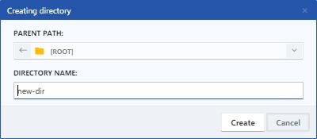
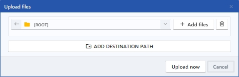
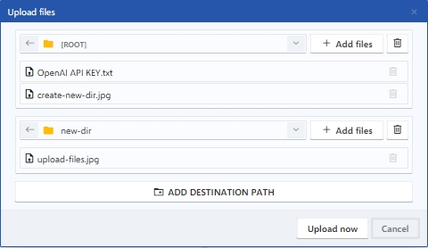
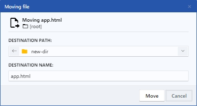
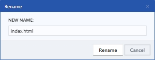

# Directory Manager

El Directory Manager permite acceder y gestionar todos los archivos y recursos utilizados en el proyecto. En el mismo se pueden encontrar los archivos HTML, CSS, JavaScript y XML, así como imágenes, fuentes, iconos y otros recursos que se requieran para el proyecto, facilitando la navegación y organización de los archivos y permitiendo acceder rápidamente a cualquier archivo necesario para el desarrollo del proyecto.

<figure><figcaption>
Directory Manager
</figcaption></figure>

### 1. New directory

Ejecuta un dialogo que permite elegir una ruta para crear una nueva carpeta.

<figure><figcaption>
Creating directory
</figcaption></figure>

### 2. Upload files

Ejecuta un dialogo que permite elegir una ruta para agregar y subir archivos. Permite subir archivos a múltiples rutas al mismo tiempo, haciendo clic en el botón **Add destination path** se agrega un nuevo campo de selección de directorio.

<figure><figcaption>
Upload files
</figcaption></figure>

 

<figure><figcaption>
Multipath file upload
</figcaption></figure>


Otra forma para subir ficheros es mediante la acción de arrastrar y soltar el fichero que desea subir sobre el árbol del directorio.


### 3. Import from URL

Ejecuta un dialogo que permite introducir una dirección URL que tenga como destino final un recurso que usted quiera guardar directamente en el directorio de su proyecto.

<figure><figcaption>
Import resource from URL
</figcaption></figure>

### 4. Copy file to...

Ejecuta un dialogo que permite elegir una ruta para copiar el fichero que previamente ha seleccionado en el directorio.

<figure><figcaption>
Copying file
</figcaption></figure>

### 5. Move file to...

Ejecuta un dialogo que permite elegir una ruta para mover el fichero que previamente ha seleccionado en el directorio.

<figure><figcaption>
Moving file
</figcaption></figure>

### 6. Rename

Ejecuta un dialogo que permite renombrar el fichero que previamente ha seleccionado en el directorio.

<figure><figcaption>
Rename file
</figcaption></figure>

### 7. Delete

Elimina el fichero que previamente ha seleccionado en el directorio.

### 8. Refresh

Actualiza la lista del directorio.
