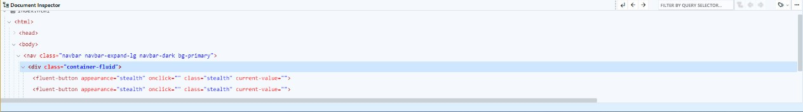
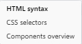

# Document Inspector

El Inspector de Documentos permite explorar y manipular los elementos del documento HTML de su proyecto. Muestra una estructura jerárquica en forma de un árbol de documento, lo que permite ver la relación entre los diferentes elementos. Permite navegar por la estructura del árbol de documento y seleccionar elementos, moverlos, duplicarlos, eliminarlos y otra serie de acciones.

<figure><figcaption>
Document Inspector
</figcaption></figure>

### 1. Select parent

Permite seleccionar el elemento padre del elemento actual en el árbol de documentos. Al hacer clic en esta opción, el Inspector de Documentos selecciona automáticamente el elemento padre del elemento actual.

### 2. Select in backward direction

Permite seleccionar el elemento anterior en el árbol de documentos. Al hacer clic en esta opción, el Inspector de Documentos selecciona automáticamente el elemento anterior al elemento actual.

### 3. Select in forward direction

Permite seleccionar el elemento siguiente en el árbol de documentos. Al hacer clic en esta opción, el Inspector de Documentos selecciona automáticamente el elemento siguiente al elemento actual.

### 4. Search filter box

Permite filtrar los elementos por nombre de selector del árbol de documentos.

### 5. Close filter mode

Esta opción elimina cualquier filtro aplicado a la búsqueda de los elementos del árbol de documentos.

### 6. Select previous filtred element

Permite seleccionar el elemento anterior filtrado en el árbol de documentos. Al hacer clic en esta opción, el Inspector de Documentos selecciona automáticamente el elemento anterior que coincide con el filtro.

### 7. Select next filtred element

Permite seleccionar el siguiente elemento filtrado en el árbol de documentos. Al hacer clic en esta opción, el Inspector de Documentos selecciona automáticamente el siguiente elemento que coincide con el filtro.

### 8. Tag options

Despliega un menú con opciones para cambiar el modo de visualización de la estructura en el árbol de documentos.

<figure><figcaption>
Tag options
</figcaption></figure>

* **HTML syntax**: Muestra la vista por defecto de las etiquetas HTML y sus atributos
* **CSS selectors**: Muestra una vista de selectores CSS.
* **Components overview**: Muestra una vista de etiquetas personalizadas de los componentes.

### 9. More elements options

Despliega un menú con opciones para trabajar con los elementos del documento.

<figure><figcaption>
More elements
</figcaption></figure>

* **Duplicate**: Permite duplicar el elemento seleccionado en el árbol de documentos.
* **Remove**: Permite eliminar el elemento seleccionado en el árbol de documentos.
* **Copy Inner HTML**: Permite copiar el contenido interno del elemento seleccionado en el árbol de documentos.
* **Copy Outer HTML**: Permite copiar el contenido externo del elemento seleccionado en el árbol de documentos.
* **Paste**: Permite pegar dentro del elemento seleccionado en el árbol de documentos.
* **Paste before**: Permite pegar un elemento antes del elemento seleccionado en el árbol de documentos.
* **Paste after**: Permite pegar un elemento después del elemento seleccionado en el árbol de documentos.
* **Paste replacing**: Permite pegar un elemento reemplazando al elemento seleccionado en el árbol de documentos.


Desde la **Paleta de Componentes** puede insertar elementos y componentes mediante la acción **Arrastrar y Soltar** directamente en la vista de la estructura del árbol de documentos.

