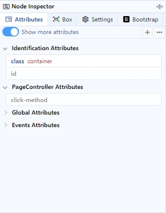
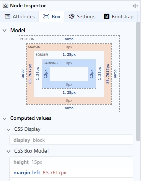
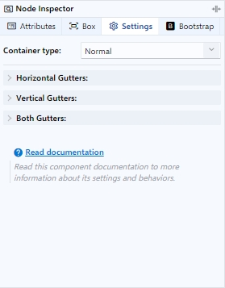
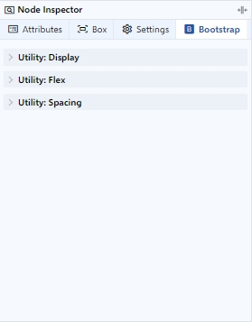
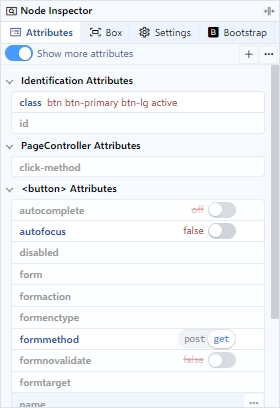
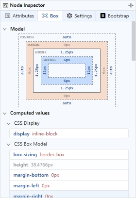
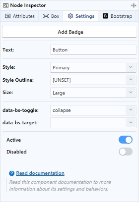
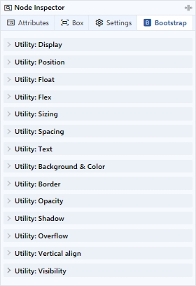

# Node Inspector

En el Node Inspector se muestran por defecto las pestañas Attributes y Box, y adicionalmente se registran las pestañas de opciones de componentes, librerías y utilidades. Al seleccionar un elemento HTML, permite gestionar sus atributos y cambiar sus propiedades, visualizar su modelo de caja y valores de estilos computados, modificar y personalizar las opciones de un componente y utilidades.

<figure><figcaption>
Attributes tab
</figcaption></figure>

 

<figure><figcaption>
Box tab
</figcaption></figure>

 

<figure><figcaption>
Settings tab
</figcaption></figure>

 

<figure><figcaption>
Bootstrap tab
</figcaption></figure>

## Attributes tab

En ésta pestaña se muestran los atributos clasificados y agrupados por categorías, lo que facilita la gestión y el manejo de los mismos.&#x20;

<figure><figcaption></figcaption></figure>

### **1. Show more attributes**

Al activar, muestra las categorías de **Global Attributes** y **Events Attributes**.

### **2. Add & Locate attribute**

Permite agregar un nuevo atributo o localizar uno que ya exista en la lista.

### **3. More options**

Muestra una lista con opciones para colapsar o expandir todo el contenido de las categorías plegables que agrupan los atributos.

### **4. Identification Attributes**

Se encuentran los atributos que se utilizan para identificar los elementos HTML. Algunos de los atributos que se pueden encontrar en esta categoría son "id" y "class".

### **5. PageController Attributes**

Contiene los atributos que se utilizan para controlar los eventos del fichero Page Controller.&#x20;

### **6. Custom Attributes**

Aquí se encuentran los atributos personalizados que se han creado para un elemento HTML y los atributos añadidos por el usuario que no se encuentren en otras categorías.

### **7. Global Attributes**

Los atributos que se utilizan de manera general en todos los elementos HTML se encuentran en esta categoría. Entre ellos se incluyen "style", "title", "tabindex", entre otros.

### **8. Events Attributes**

En esta categoría se encuentran los atributos que se utilizan para controlar eventos específicos de los elementos HTML. Algunos ejemplos de estos atributos son "onclick", "onmouseover", "onkeydown", entre otros.

## Box tab

En esta pestaña se puede visualizar las dimensiones del elemento, incluyendo el ancho, alto, padding, border y margin. También se puede ver los valores de estilo computados que se aplican al elemento.

<figure><figcaption></figcaption></figure>

## Settings tab

Ésta pestaña se muestra cuando se hace clic sobre un elemento HTML que esté registrado en un paquete de componentes, accediendo así a las opciones del componente seleccionado y brindándole una serie de controles de personalización visual y de comportamiento.

<figure><figcaption></figcaption></figure>

### 1. Edit component items

Permite manejar la lista de ítems del componente, lo que incluye inspeccionar, agregar, eliminar o mover dichos ítems.

### 2. Add icons

Lanza el diálogo de iconos para seleccionar un icono e insertarlo en el componente.

### 3. Add element

Agrega un elemento predeterminado al componente, proporcionando así funcionalidad adicional al mismo. Este elemento puede ser un badge, un botón, un tooltip, etc.

### 4. Edit values

Permite establecer o editar textos, números y otros valores asociados al componente de forma manual y/o mediante dialogos de selección.&#x20;

### 5. List values

Despliega una lista para seleccionar y/o introducir valores asociados al componente.

### 6. Switch values

Permite alternar entre un valor u otro.

### 7. Slot assimilator

Mediante la acción drag and drop sobre el área definida, permite insertar desde la Paleta de Componentes un elemento o componente en el slot nombrado.

### 8. Documentation link

Enlace externo, que al hacer clic le llevará a la pagina de la documentación oficial y extendida del componente seleccionado.


Para conocer más detalles sobre los paquetes de componentes registrados, visite la página [Integrated Packages](../../../packages/integrated-packages/).


## Bootstrap tab

Ésta pestaña se muestra siempre que se esté usando Bootstrap en el documento. Las Utility Classes de Bootstrap son una serie de clases CSS predefinidas, y se utilizan para agregar estilos y efectos a cualquier elemento HTML seleccionado en el documento. Estas clases se utilizan para realizar rápidamente estilos comunes, como el ajuste de display, spacing, position, background color, border y mucho más.

<figure><figcaption></figcaption></figure>

