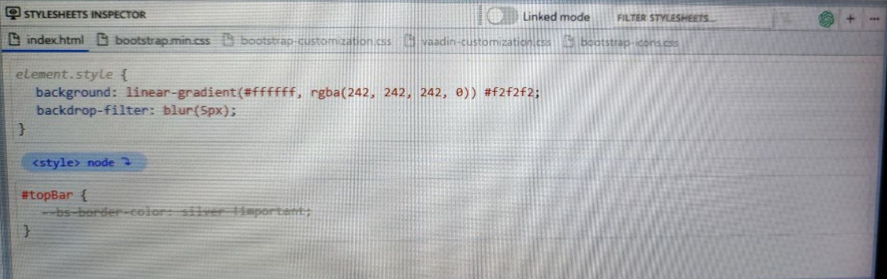
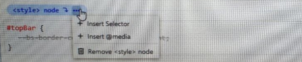
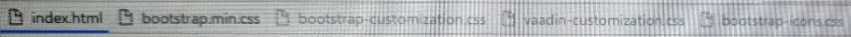

# Stylesheets Inspector

El Inspector de Estilos permite visualizar de manera clara y organizada la lista de todos los bloques CSS que coinciden con el elemento seleccionado en el documento. Esos bloques de estilo se encuentran agrupados en pestañas, lo cual facilita la navegación, selección y edición de los estilos a aplicar, y éstas pestañas representan las hojas de estilo que se encuentran linkeadas en el documento que se esté editando. Los bloques del elemento estilo y de las etiquetas `<style>` se agrupan en una pestaña con el nombre del documento al cual pertenecen.&#x20;

Este panel además cuenta con diversas opciones de personalización, entre ellas se encuentran la posibilidad de insertar un selector específico, insertar regla `@media` para aplicar estilos en diferentes resoluciones de pantalla, crear un nuevo nodo `<style>` en el documento, crear un nuevo fichero CSS, realizar búsquedas mediante el filter, activar el modo linked y desplegar el asistente de inteligencia artificial.

<figure><figcaption></figcaption></figure>

### 1) CSS blocks

Lorem ipsum dolor sit amet, consectetur adipiscing elit. Sed convallis mi vel elit blandit, at malesuada sapien volutpat. Cras vitae mauris euismod, bibendum mauris vel, lacinia velit. Duis id dui eget magna tristique bibendum. Praesent lobortis, sapien vitae sodales hendrerit, nunc libero malesuada mi, ac eleifend lacus enim in massa.

<figure><figcaption></figcaption></figure>

<figure><figcaption></figcaption></figure>

<figure><figcaption></figcaption></figure>

* Element style
* Node style
* CSS page block style

### 2) Tabs

Lorem ipsum dolor sit amet, consectetur adipiscing elit. Sed convallis mi vel elit blandit, at malesuada sapien volutpat. Cras vitae mauris euismod, bibendum mauris vel, lacinia velit.

<figure><figcaption></figcaption></figure>

### 3) Linked mode

Lorem ipsum dolor sit amet, consectetur adipiscing elit. Sed convallis mi vel elit blandit, at malesuada sapien volutpat. Cras vitae mauris euismod, bibendum mauris vel, lacinia velit.

### 4) Filter stylesheets

Lorem ipsum dolor sit amet, consectetur adipiscing elit. Sed convallis mi vel elit blandit, at malesuada sapien volutpat. Cras vitae mauris euismod, bibendum mauris vel, lacinia velit.

### 5) IA Assistant

Lorem ipsum dolor sit amet, consectetur adipiscing elit. Sed convallis mi vel elit blandit, at malesuada sapien volutpat. Cras vitae mauris euismod, bibendum mauris vel, lacinia velit.

### 6) More options

Lorem ipsum dolor sit amet, consectetur adipiscing elit. Sed convallis mi vel elit blandit, at malesuada sapien volutpat. Cras vitae mauris euismod, bibendum mauris vel, lacinia velit.

<figure><figcaption></figcaption></figure>

* Insert selector
* Insert @media
* Create \<style> node
* Create CSS file
