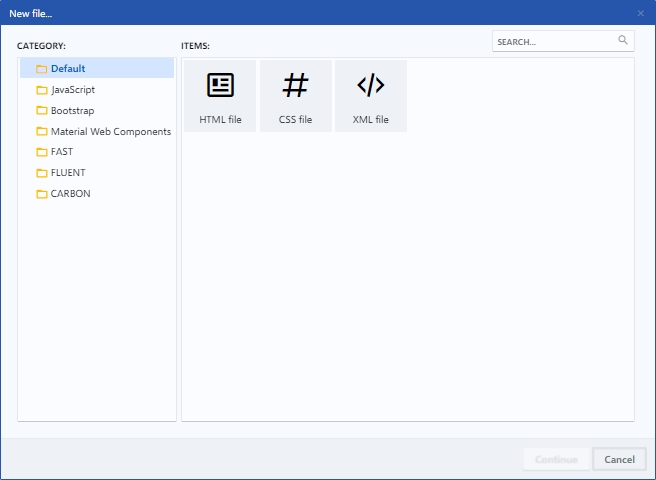
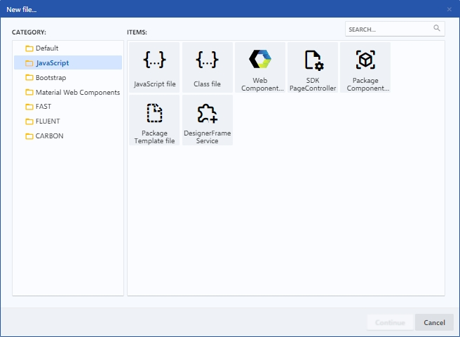
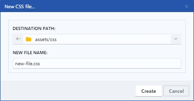

# Files

Desde la opción New de la pestaña HOME de la Upper Toolbar puede crear nuevos ficheros en blanco en diferentes formatos, como HTML, XML, CSS y JavaScript. También tiene opciones para crear ficheros JavaScript avanzados como clases, controladores de paginas y componentes, además de ficheros específicos de las librerías integradas.

<figure><figcaption>
Default files
</figcaption></figure>

 

<figure><figcaption>
JavaScript files
</figcaption></figure>

## Default/Blank Files

Al hacer clic en un nuevo fichero HTML, XML, CSS o JavaScript, se abrirá un dialogo en el cual puede cambiar el nombre y elegir la ruta de destino donde desee guardar el fichero.

<figure><figcaption>
New CSS file
</figcaption></figure>

