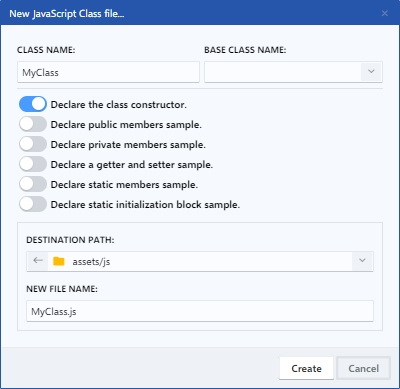

# Class

Las clases en JavaScript son una forma de estructurar y organizar el código en objetos reutilizables, lo que permite crear aplicaciones web más escalables y fáciles de mantener. En este archivo, se pueden definir propiedades y métodos de la clase, y se pueden utilizar para crear instancias de la clase y manipularlas según sea necesario.

<figure><figcaption>
New JavaScript Class file
</figcaption></figure>

### 1. Class name

El nombre de una clase de JavaScript es simplemente el identificador que se utiliza para referirse a esa clase en el código. Por lo general, los nombres de las clases comienzan con una letra mayúscula y utilizan el estilo de nomenclatura de camello, en el que cada palabra dentro del nombre se escribe con una letra mayúscula.

### 2. Base class name

Permite introducir el nombre base de una clase, también conocido como clase padre, es simplemente el nombre de la clase de la que se heredan las propiedades y métodos.

### 3. Switcher options

Al activar las opciones disponibles, se agregará en el código de la clase JavaScript un ejemplo de la opción activada. A continuación, se describen las diferentes opciones que se pueden encontrar en estos switchers:

* **Declare the class constructor**: Esta opción permite declarar un constructor para la clase, que es un método especial que se ejecuta automáticamente cuando se crea una instancia de la clase. El constructor puede aceptar parámetros y se utiliza para inicializar los miembros de la clase.
* **Declare public members sample**: Esta opción permite declarar miembros públicos de la clase, que son aquellos que se pueden acceder desde fuera de la clase. Por ejemplo, se pueden declarar propiedades o métodos que se pueden llamar desde otras partes del código.
* **Declare private members sample**: Esta opción permite declarar miembros privados de la clase, que son aquellos que solo se pueden acceder desde dentro de la clase. Por ejemplo, se pueden declarar propiedades o métodos que solo se pueden llamar desde otros métodos de la clase.
* **Declare a getter and setter sample**: Esta opción permite declarar propiedades con getters y setters, que son métodos especiales que se utilizan para acceder y modificar el valor de una propiedad. Los getters se utilizan para obtener el valor de una propiedad, mientras que los setters se utilizan para establecer el valor de una propiedad.
* **Declare static members sample**: Esta opción permite declarar miembros estáticos de la clase, que son aquellos que se pueden acceder desde la propia clase, en lugar de una instancia de la misma. Por ejemplo, se pueden declarar métodos estáticos que se pueden llamar directamente desde la clase, sin necesidad de crear una instancia de la misma.
* **Declare initialization block sample**: Esta opción permite declarar un bloque de inicialización para la clase, que es un conjunto de declaraciones que se ejecutan cuando se crea una instancia de la clase. Este bloque de inicialización se ejecuta antes del constructor de la clase y se utiliza para inicializar miembros de la clase que no se pueden inicializar directamente en el constructor.

### 4. Destination path & File name

Permite elegir la ruta de destino donde desee guardar el fichero y establecer un nombre para el mismo.
