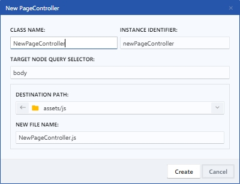

# Page Controller

Un Page Controller es una clase en JavaScript que se utiliza para controlar la lógica de una página web. Es una forma de separar la funcionalidad de una página en diferentes partes, lo que permite una mejor organización y mantenimiento del código.

Al crear un nuevo Page Controller, se definen tres métodos que se ejecutan en diferentes momentos del ciclo de vida del controlador:

* `onCreate()`: Este método se ejecuta cuando se crea el controlador. Puede utilizarse para realizar cualquier configuración necesaria antes de que el controlador se cargue.
* `onLoad()`: Este método se ejecuta cuando se carga el controlador. Puede utilizarse para realizar cualquier acción necesaria después de que el controlador se ha creado y antes de que el DOM esté listo.
* `onReady()`: Este método se ejecuta cuando tanto el documento como el controlador están listos. Puede utilizarse para realizar cualquier acción necesaria después de que el controlador se ha creado y el DOM está listo.

Luego, se crea una instancia del controlador pasando un objeto como primer argumento y un selector de consulta de nodo como segundo argumento.

<figure><figcaption>
New Page Controller file
</figcaption></figure>

### 1. Class name

En este campo se puede introducir el nombre de la clase que se utilizará para definir el Page Controller.

### 2. Instance identifier

Este campo permite introducir un identificador único para la instancia del Page Controller que se va a crear. Este identificador se utilizará para hacer referencia a la instancia en otras partes del código y puede ser útil para realizar tareas como la eliminación o la modificación de la instancia en el futuro.

### 3. Target node query selector

En este campo se puede introducir un selector de consulta para especificar el nodo HTML de destino para la plantilla. Este selector puede ser cualquier selector de consulta válido que se utilizaría normalmente para seleccionar un nodo HTML en el DOM.

### 4. Destination path & File name

Permite elegir la ruta de destino donde desee guardar el fichero y establecer un nombre para el mismo.
