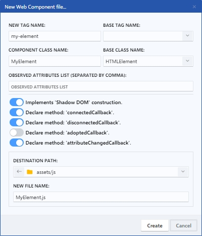

# Web Component

Un web component es un conjunto de tecnologías web que permiten la creación de elementos personalizados reutilizables en HTML y JavaScript. Es decir, son bloques de código que encapsulan cierta funcionalidad y se pueden utilizar en distintas partes de una página web o de una aplicación. Los web components permiten la creación de componentes personalizados con sus propios estilos, comportamientos y propiedades.

<figure><figcaption>
New Web Component file
</figcaption></figure>

### 1. New tag name

Se refiere al nombre de etiqueta del nuevo elemento personalizado que se creará. Este nombre debe estar en minúsculas y separado por guiones.

### 2. Base tag name

Permite introducir el nombre de un elemento base en el que se basará el nuevo elemento personalizado. Por ejemplo, si se quiere crear un nuevo elemento personalizado a partir de un botón, se puede colocar 'button' en este campo, al mismo tiempo cambiará automáticamente la **Base class name** de la cual heredará el nuevo elemento personalizado. Por defecto se deja en blanco si se quiere heredar todo el comportamiento de un de un elemento HTML.&#x20;

### 3. Component class name

Se refiere al nombre de la clase que se creará para el nuevo elemento personalizado.

### 4. Base class name

Es el nombre de la clase base en la que se basará la nueva clase del elemento personalizado. Por ejemplo, si estableció un **Base tag name** 'button', entonces aquí se cambiará el campo al nombre de la clase 'HTMLButtonElement', de lo contrario, si no estableció un nombre de etiqueta base entonces por defecto se heredará de la clase 'HTMLElement'.

### 5. Observed attibutes list

Permite insertar separado por comas, los nombres de los atributos que se quieren observar en el nuevo elemento personalizado.

### 6. Switcher options

* **Implements 'Shadow DOM' construction**: Este switcher activa la implementación del Shadow DOM en el nuevo elemento personalizado. El Shadow DOM es una técnica que permite encapsular el HTML y CSS de un elemento personalizado, para que no se vea afectado por estilos o scripts externos.
* **Declare method 'connectedCallback'**: Este switcher activa la declaración del método 'connectedCallback', que se ejecuta automáticamente cuando el elemento personalizado se conecta al DOM.
* **Declare method 'disconnectedCallback'**: Este switcher activa la declaración del método 'disconnectedCallback', que se ejecuta automáticamente cuando el elemento personalizado se desconecta del DOM.
* **Declare method 'adoptedCallback'**: Este switcher activa la declaración del método 'adoptedCallback', que se ejecuta automáticamente cuando el elemento personalizado se mueve a un nuevo documento.
* **Declare method 'attributeChangedCallback'**: Este switcher activa la declaración del método 'attributeChangedCallback', que se ejecuta automáticamente cuando se cambia un atributo observado del elemento personalizado.

### 7. Destination path & File name

Permite elegir la ruta de destino donde desee guardar el fichero y establecer un nombre para el mismo.
