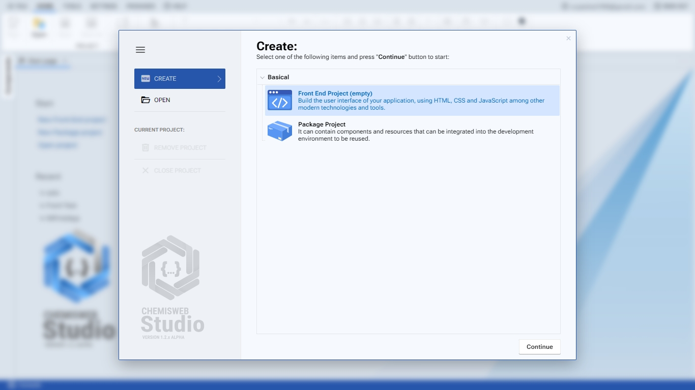

# Package Projects

Los Proyectos Paquetes son enfocados a la creación de componentes y extensiones que posteriormente podrán ser activados en el IDE. Cuando un paquete está activo, es cargado inmediatamente durante el proceso de inicialización del IDE. Un paquete puede incluir un único componente, una biblioteca completa de componentes, o una biblioteca de utilidades.

## Creando un nuevo proyecto Paquete

1. Haga clic en el botón de menú **FILE**, seleccione la opción **Package Project** y presione el botón **Continuar**.
2. Ingrese el nombre de su paquete. Automáticamente, se asignará un nombre a la clase principal del paquete y se definirá la ruta del archivo fachada. Podrá modificar estas asignaciones si así lo desea.
3. Haga clic en el botón **Create**.

<figure><figcaption><p>Video gif creando un nuevo proyecto paquete</p></figcaption></figure>

## Scaffolding

Al crear un nuevo proyecto paquete, la estructura de archivos y directorios proporcionada como punto de partida es la que se muestra a continuación:


```
├── .compiler
│   └── default.config.js
├── build
├── libs
├── src
│   ├── components
│   │   └── MyComponent.js
│   └── MyFirstPackage.js
├── autoload.js
└── .package-project
```


1. **.compiler:** Carpeta destinada a contener los archivos creados para un perfil de compilación. Los perfiles de compilación se pueden crear haciendo clic en el botón **New** de la barra de herramientas **Project** y seleccionando el tipo de perfil a crear en la lista de menú de archivos. Por defecto se creara un perfil con las configuraciones basicas para compilar el paquete.
2. **build: C**arpeta destinada a almacenar el bundle generado por el proceso de compilacion.
3. **libs:** Carpeta contenedora de las bibliotecas y/o dependencias externas utilizadas en el proyecto.
4. **src:** Carpeta que contiene el fichero con la clase principal de proyecto, por defecto se proporciona un ejemplo. Puede contener las siguientes subcarpetas:
   * **components:** Carpeta destinada a contener los componentes que se registraran en el IDE, por defecto se proporciona un ejemplo.
5. **autoload.js:** Archivo usado por el IDE para hacer la carga del paquete cuando esta activado.
6. **.package-project:** Archivo principal del proyecto. Su contenido interno es presentado en formato XML, conteniendo informacion sobre el proyecto tales como nombre, tipo y ruta del indice fachada, así como los [Perfiles de Compilación](https://emphaxy.gitbook.io/chemisweb-studio-docs/projects/files/compiler-profiles) creados. Tambien puede contener declaraciones de clausulas de importacion de recursos.
