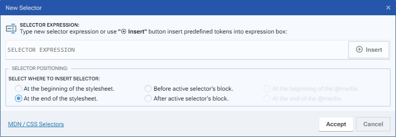

# CSS Selector dialog

En este dialogo podrá insertar un nuevo selector CSS y elegir la posicion que tendrá el mismo en el documento o en el bloque.

<figure><figcaption></figcaption></figure>

## 1. Selector expression

* **Input box:** En esta caja, puede introducir manualmente el selector o elegir insertarlo automáticamente mediante el botón "Insertar".
* **Insert button:** Este botón muestra una lista organizada y categorizada de los selectores presentes en el documento, además de combinatorios, pseudo-clases, pseudo-elementos y pseudo-funciones.

## 2. Selector positioning

* At the beginning of the stylesheet: Permite insertar el nuevo selector al inicio del fichero css.
* At the end of the stylesheet: Permite insertar el nuevo selector al final del fichero css.
* Before active selector's block: Permite insertar el nuevo selector antes del bloque seleccionado.
* After active selector's block: Permite insertar el nuevo selector despues del bloque seleccionado.
