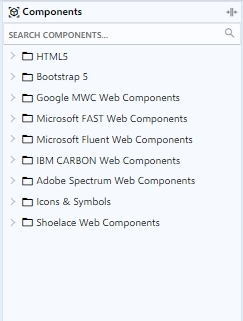
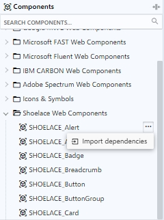

# Component Palette

En la paleta de componentes se pueden encontrar una amplia variedad de elementos nativos HTML, Web Components, componentes basados en clases, utilidades e iconos para utilizar en sus proyectos. Se pueden arrastrar y soltar en el Marco de Diseño para configurarlos y personalizarlos. La paleta de componentes también permite la visualización de paquetes de componentes que hayan sido creados y activados en un [Proyecto Paquete](../../../projects/package-projects/).

Cuando arrastre y suelte un componente o utilidad en el Marco de Diseño, se ejecutará automáticamente el proceso de importación de sus dependencias. Estas dependencias se guardarán en la ruta _<mark style="background-color:yellow;">/assets/libs/</mark>_ del directorio de archivos del proyecto y se referenciarán automáticamente en el documento HTML mediante las etiquetas `<link>` para los archivos CSS y `<script>` para los archivos Javascript.

<figure><figcaption>
Components palette
</figcaption></figure>

 

<figure><figcaption>
Import dependencies
</figcaption></figure>

* HTML5: Conjunto de elementos nativos básicos para la maquetación de documentos HTML.
* Bootstrap 5: Es un toolkit que ofrece una amplia variedad de herramientas y componentes para crear sitios y aplicaciones web de manera rápida y eficiente.
* Google MWC Web Components: Colección de componentes web abiertos y reutilizables desarrollados por Google con el diseño de Material Design.
* Microsoft FAST Web Components: Colección de componentes web abiertos y reutilizables desarrollados por Microsoft para facilitar la creación de aplicaciones web modernas y rápidas.
* Microsoft Fluent Web Components: Colección de componentes web abiertos y reutilizables desarrollados por Microsoft extendiendo de los componentes web de FAST pero con un diseño diferente.
* IBM Carbon Web Components: Colección de componentes web abiertos y reutilizables desarrollados por IBM.&#x20;
* Adobe Spectrum Web Components: Colección de componentes web abiertos y reutilizables desarrollados por Adobe.
* Shoelace Web Components: Colección de componentes web abiertos y reutilizables desarrollados por [Cory LaViska](https://twitter.com/claviska).
* Icons & Symbols: El [diálogo de iconos](icon-dialog.md) contiene una gran cantidad de iconos organizados por librerías que puede seleccionar e insertar en sus proyectos de manera rápida y fácil.


Para conocer más detalles sobre los paquetes registrados, visite la página [Integrated Packages](../../../packages/integrated-packages/).

