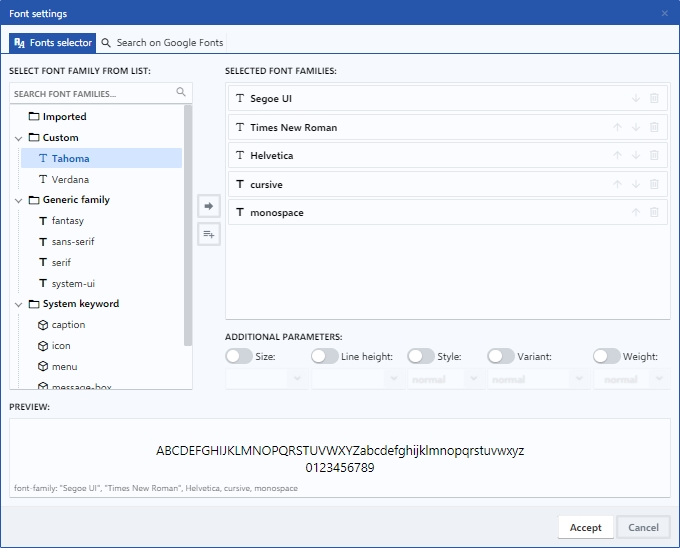
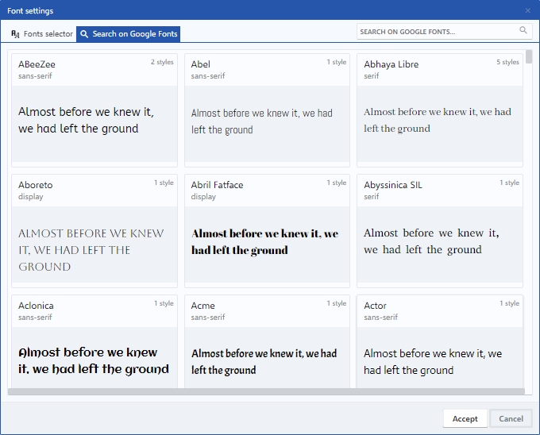
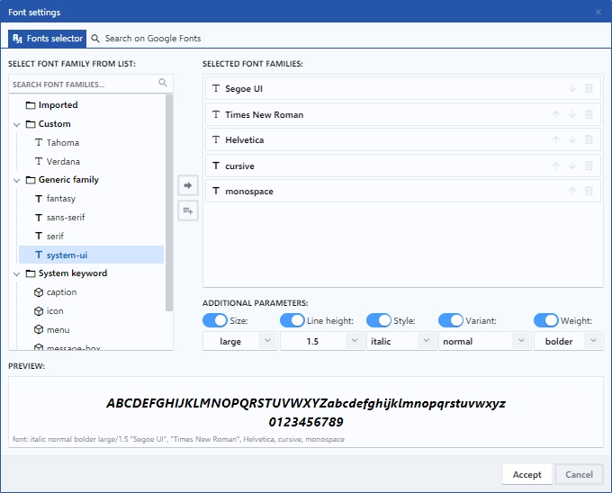
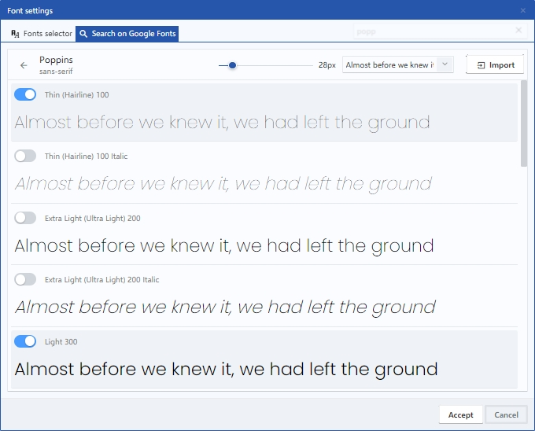
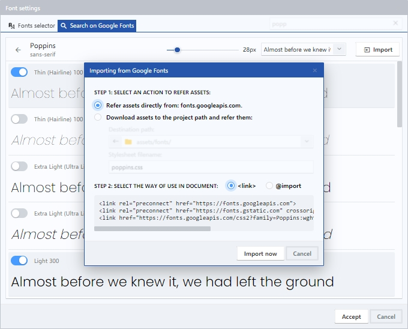
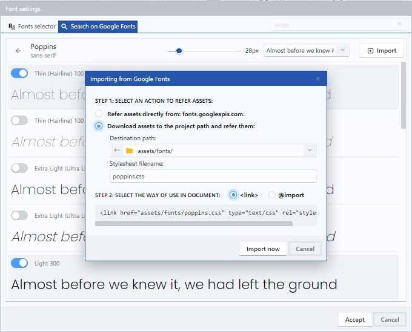

# Font settings dialog

En este dialogo, podrás personalizar el aspecto de tus documentos eligiendo las fuentes que mejor se adapten a tus necesidades. Podrás elegir entre una amplia variedad de fuentes, ajustar el tamaño, estilo, peso y variante de la fuente seleccionada. También puedes ver una vista previa en tiempo real de cómo se verá tu texto con la selección de fuentes realizada. Permite el acceso a Google Fonts desde una interfaz que permite explorar, seleccionar y personalizar fuentes tipográficas de alta calidad de manera fácil y rápida. Esta interfaz está diseñada para ayudarle a encontrar la fuente adecuada para sus proyectos y personalizarla según sus necesidades específicas.

<figure><figcaption>
Font settings dialog
</figcaption></figure>

 

<figure><figcaption>
Font settings dialog - Google Fonts
</figcaption></figure>

## Fonts selector tab

El font selector tab es una pestaña del diálogo de configuración de fuentes que te permite seleccionar la fuente que deseas utilizar en tus documentos. Se divide en cuatro partes: Select font family from list, Selected font families, Additional parameters y Preview. En ellas, podrás buscar y seleccionar las fuentes que quieras usar, ordenarlas y ajustar parámetros adicionales como tamaño, estilo, peso, variante de la fuente y visualizar como se verá el texto en el documento.

<figure><figcaption>
Fonts selector tab
</figcaption></figure>

### 1. Select font family from list

En ésta sección se muestran los nombres de fuentes clasificados y agrupados por categorías. Permite buscar y seleccionar las fuentes que desee usar en su documento.

* **Imported**: Agrupa las fuentes importadas desde Google Fonts.
* **Custom**: Agrupa las fuentes agregadas manualmente por el usuario.
* **Generic family**: Agrupa las fuentes que se utilizan como alternativas genéricas en caso de que la fuente especificada no esté disponible.
* **System keyword**: Agrupa las fuentes que están instaladas en el sistema operativo del ordenador.

### 2. Selected font families

En ésta sección se irán listando los nombres de fuentes seleccionados desde la lista. Cada nombre de fuente tendrá la opción de cambiar el orden en el que se desea posicionar, o remover de la sección.

### 3. Additional parameters

En ésta sección se encuentran algunos parámetros que puede activar para establecer diferentes ajustes adicionales a la selección de fuentes seleccionadas.

* **Size**: Al activar, se habilita la opción de seleccionar de una lista o introducir manualmente un valor para cambiar el tamaño del texto.
* **Line height**: Al activar, se habilita la opción de seleccionar de una lista o introducir manualmente un valor para cambiar la distancia entre las líneas de texto.
* **Style**: Al activar, se habilita la opción de seleccionar de una lista el estilo de la fuente.
* **Variant**: Al activar, se habilita la opción de seleccionar de una lista la variante de la fuente.
* **Weight**: Al activar, se habilita la opción de seleccionar de una lista el peso de la fuente.

### 4. Preview

En ésta sección se muestra en tiempo real un texto de ejemplo que le permite visualizar como se verá el texto de su documento con la selección de fuente realizada. Adicionalmente se muestra la propiedad CSS resultante de la selección de fuente que ha realizado.

## Search on Google Fonts tab

Google Fonts es una biblioteca en línea gratuita de fuentes tipográficas. Ofrece una amplia variedad de opciones de fuentes para elegir, previsualizar cómo se verán en su documento y personalizar aspectos como el tamaño y el peso de la fuente.&#x20;

<figure><figcaption>
Search on Google Fonts tab
</figcaption></figure>

### 1. Font preview selector

Esta sección muestra la lista de formatos disponibles de la fuente seleccionada, previsualiza cómo se verá la fuente y permite elegir uno o varios de esos formatos para importarlos.

### 2. Font size control

Permite aumentar o disminuir el tamaño del texto en la previsualización de los formatos disponibles de la fuente seleccionada.

### 3. Text sample

Modifica el texto que se muestra en la previsualización de los formatos disponibles de la fuente seleccionada, puede elegir una opción de la lista o ingresar un texto personalizado.

### 4. Import

Ejecuta el dialogo en el cual se brindan las opciones de importación de la fuente seleccionada.

<figure><figcaption>
Refer from Google Fonts server
</figcaption></figure>

 

<figure><figcaption>
Download font and refer from local path
</figcaption></figure>

#### 1. Step 1: Select an action to refer assets:

* **Refer assets directly from fonts.googleapis.com**: Seleccione para enlazar directamente desde Google Fonts mediante el uso de la URL del servidor.
* **Download assets to the project path and refer them**: Seleccione para descargar e importar la fuente seleccionada hacia una carpeta del directorio del proyecto.
* **Destination path**: Permite cambiar la ruta en la cual se desea guardar la fuente seleccionada.
* **Stylesheet filename**: Permite renombrar el fichero CSS que se descargará a la ruta del proyecto.

#### 2. Step 2: Select the way of use in document:

* **\<link>**: Hace uso de la etiqueta `<link>` para situar en el encabezado `<head>` del documento el código que enlazará con la fuente importada.
* **@import**: Hace uso de la etiqueta `<style>` y la regla _@import_ para situar en el encabezado `<head>` del documento el código que enlazará con la fuente importada.
