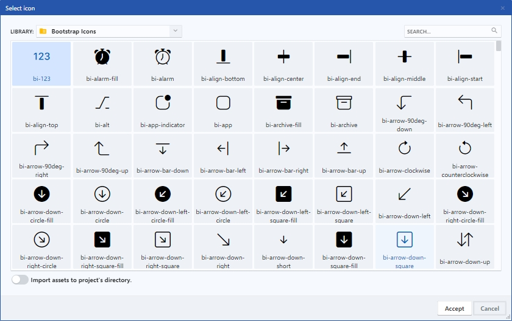

# Icon dialog

En este dialogo se encuentran las librerías de iconos integradas, cada librería contiene una amplia variedad de iconos predefinidos. También se cuenta con un buscador que facilita el filtrado al hacer una búsqueda por nombre de icono, y la opción de referenciar la librería de manera online o importar los archivos a un directorio local del proyecto.

<figure><figcaption>
Icon dialog
</figcaption></figure>

### 1. Library

Incluye las librerías [Bootstrap Icons](https://icons.getbootstrap.com/), [Material Icons](https://fonts.google.com/icons?icon.set=Material+Icons) y [Material Symbols](https://fonts.google.com/icons?icon.set=Material+Symbols). \
Bootstrap Icons es una librería de iconos de código abierto, de alta calidad y gratuita con más de 1800 iconos. Ofrece una gran variedad de categorías como redes sociales, interfaz de usuario, e iconos de relleno.\
Material Icons y Material Symbols, desarrollados por Google, ofrecen una amplia variedad de iconos diseñados para representar objetos y conceptos comunes. Material Icons incluye más de 4,500 iconos en una variedad de estilos y categorías, mientras que Material Symbols ofrece más de 1,000 iconos específicos para conceptos y objetos.

### 2. Search

Permite buscar y filtrar fácilmente en el conjunto de iconos.

### 3. Icons preview

Área que permite visualizar y seleccionar los iconos.

### 4. Import mode

Control para establecer el modo de importación de la librería de iconos al proyecto.

