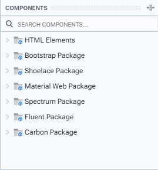
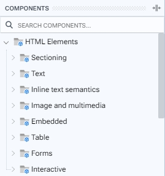

# Component Palette

En la paleta de componentes se encuentran los paquetes actualmente activos. Aquí se visualizan los componentes creados y registrados en los Proyectos Paquetes, los cuales pueden ser arrastrados y soltados en el Marco de Diseño. La paleta incluye una barra de búsqueda que facilita el filtrado de componentes según la palabra introducida.

Por defecto, el paquete de elementos HTML estará activado en la paleta. Puede gestionar la activación/desactivación de otros paquetes a través del menú Package en la Barra de Menú.

<figure><figcaption>
Components palette
</figcaption></figure>

 

<figure><figcaption>
Package expanded
</figcaption></figure>


Para conocer más detalles sobre los paquetes registrados, visite la página [Integrated Packages](../../packages/integrated-packages/).

