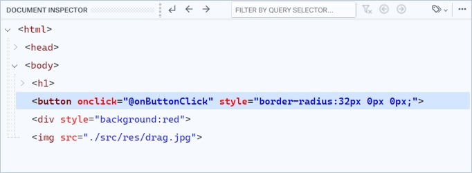
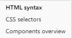
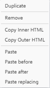

# Document Inspector

El Inspector de Documentos permite explorar y manipular los elementos del documento HTML de su proyecto. Muestra una estructura jerárquica en forma de un árbol de documento que permite ver la relación entre los diferentes elementos.

<figure><figcaption>
Document Inspector
</figcaption></figure>

## 1. Select parent

Selecciona el elemento padre del elemento HTML que se encuentra actualmente seleccionado.

## 2. Select in backward direction

Selecciona el elemento anterior inmediato del elemento HTML que se encuentra actualmente seleccionado.

## 3. Select in forward direction

Selecciona el elemento siguiente inmediato del elemento HTML que se encuentra actualmente seleccionado.

## 4. Filter by query selector

Permite filtrar los elementos mostrados en el arbol utilizando un selector de consulta para filtrar específicamente aquellos que cumplen con los criterios definidos.

## 5. Close filter mode

Elimina el filtro de selector de consulta aplicado a la búsqueda de los elementos del árbol.

## 6. Select previous filtred element

Selecciona el elemento anterior en la lista de los elementos mostrados por la consulta de selector aplicada.

## 7. Select next filtred element

Selecciona el elemento siguiente en la lista de los elementos mostrados por la consulta de selector aplicada.

## 8. Tag options

Despliega un menú con opciones para cambiar el modo de visualización de la estructura en el árbol de documentos.

<figure><figcaption>
Tag options
</figcaption></figure>

* **HTML syntax**: Muestra la vista por defecto de las etiquetas HTML y sus atributos
* **CSS selectors**: Muestra una vista de selectores CSS.
* **Components overview**: Muestra una vista de nombres de componentes definidos por los paquetes.

## 9. More elements options

Despliega un menú con acciones disponibles para el elemento seleccionado.

<figure><figcaption>
More elements
</figcaption></figure>

* **Duplicate**: Permite duplicar el elemento seleccionado.
* **Remove**: Permite eliminar el elemento seleccionado.
* **Copy Inner HTML**: Permite copiar el contenido interno del elemento seleccionado.
* **Copy Outer HTML**: Permite copiar el contenido externo del elemento seleccionado.
* **Paste**: Permite pegar dentro del elemento seleccionado.
* **Paste before**: Permite pegar antes del elemento seleccionado.
* **Paste after**: Permite pegar después del elemento seleccionado.
* **Paste replacing**: Permite pegar reemplazando al elemento seleccionado.

## 10. Arbol de elementos

Area visual donde se muestran los elementos del documento.


Desde la **Paleta de Componentes** puede insertar elementos y componentes mediante la acción **Arrastrar y Soltar** directamente en una posicion del arbol de elementos.

