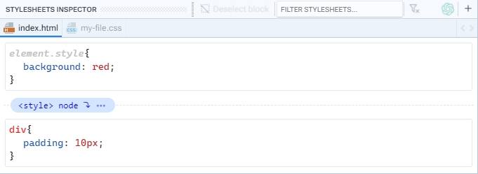
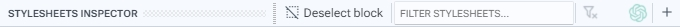
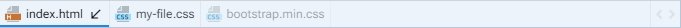
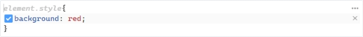
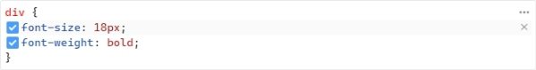

# Stylesheets Inspector

El Inspector de Estilos permite visualizar de manera clara y organizada la lista de todos los bloques CSS que coinciden con el elemento seleccionado en el documento. Esos bloques de estilo se encuentran agrupados en pestañas, lo cual facilita la navegación, selección y edición de los estilos a aplicar, y éstas pestañas representan las hojas de estilo que se encuentran linkeadas en el documento que se esté editando. Los bloques del elemento estilo en linea y de las etiquetas `<style>` se agrupan en una pestaña con el nombre del documento al cual pertenecen.

<figure><figcaption>
Stylesheets inspector
</figcaption></figure>

## 1. Panel toolbar

<figure><figcaption>
Panel toolbar
</figcaption></figure>

Barra de comandos que contiene las acciones detalladas a continuacion:

* **Deselect block:** Permite retirar la [seleccion del bloque](seleccion-de-bloque.md) CSS seleccionado.
* **Filter stylesheets:** Permite filtrar los bloques mostrados en el inspector para mostrar específicamente aquellos que cumplen con los criterios definidos.
* **Close filter mode:** Elimina el filtro de consulta aplicado a la búsqueda.
* **Asistente de ChatGPT:** Permite ejecutar un asistente de ChatGPT.
* **Insert selector:** Ejecuta el dialogo [CSS Selector](../../dialogs/css-selector-dialog.md) que le permitirá insertar un nuevo selector para el bloque CSS seleccionado
* **Create \<style> node:** Permite crear un nuevo nodo \<style> en el documento.

## 2. Tabs

En esta sección se muestran las pestañas que contienen los bloques de estilo asociados al elemento seleccionado. La primera pestaña siempre corresponderá a la página que contiene los estilos en línea y los nodos \<style>. A continuación, se mostrarán las pestañas correspondientes a los archivos de estilo vinculados de manera relativa al documento. Aquellas pestañas que aparezcan visualmente transparentes indican que no contienen ningún bloque CSS que modifique el elemento seleccionado.

<figure><figcaption>
Tabs section
</figcaption></figure>


Si haces doble clic en el nombre del archivo .css en la pestaña, se abrirá automáticamente en el área de trabajo.


## 3. CSS blocks

En esta area se muestran los bloques de estilo CSS. Un bloque CSS se refiere a un conjunto de reglas de estilo que se aplican a uno o más elementos en una página web.

* **element.style:** El estilo se aplica directamente al elemento HTML utilizando el atributo `style`. Este tipo de estilo tiene prioridad sobre otras reglas de estilo debido a la especificidad.

<figure><figcaption>
element.style block
</figcaption></figure>

* **\<style> node:** Las reglas de estilo se definen dentro de la etiqueta `<style>` en la misma página HTML. Este tipo de estilo tiene una prioridad intermedia en comparación con los estilos en línea y los estilos externos.

<figure><figcaption>
&#x3C;style> node block
</figcaption></figure>

* **external style:** Las reglas de estilo se almacenan en un archivo CSS externo. Este archivo se enlaza con el documento HTML a través de una etiqueta `<link>`. Los estilos externos tienen la menor prioridad.

<figure><figcaption>
external style block
</figcaption></figure>

