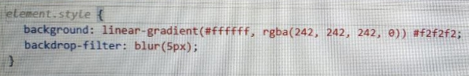

# Stylesheets Inspector

El Inspector de Estilos permite visualizar de manera clara y organizada la lista de todos los bloques CSS que coinciden con el elemento seleccionado en el documento. Esos bloques de estilo se encuentran agrupados en pestañas, lo cual facilita la navegación, selección y edición de los estilos a aplicar, y éstas pestañas representan las hojas de estilo que se encuentran linkeadas en el documento que se esté editando. Los bloques del elemento estilo en linea y de las etiquetas `<style>` se agrupan en una pestaña con el nombre del documento al cual pertenecen.

<figure><figcaption>
Stylesheets inspector
</figcaption></figure>

## 1. Panel toolbar

<figure><figcaption></figcaption></figure>

Barra de comandos que contiene las acciones detalladas a continuacion:

* **Deselect block:** Permite retirar la seleccion del bloque CSS seleccionado.
* **Filter stylesheets:** Permite filtrar los bloques mostrados en el inspector para mostrar específicamente aquellos que cumplen con los criterios definidos.
* **Close filter mode:** Elimina el filtro de consulta aplicado a la búsqueda.
* **Asistente de ChatGPT:** Permite ejecutar un asistente de ChatGPT.
* **Insert selector:** Ejecuta el dialogo [CSS Selector](../../dialogs/css-selector-dialog.md) que le permitirá insertar un nuevo selector para el bloque CSS seleccionado
* **Create \<style> node:** Permite crear un nuevo nodo \<style> en el documento.

## 2. Tabs

En esta sección se presentan las pestañas que contienen los bloques de estilo asociados al elemento seleccionado. La primera pestaña siempre corresponderá a la página que contiene los estilos en línea y los nodos \<style>. A continuación, se mostrarán las pestañas correspondientes a los archivos de estilo vinculados de manera relativa al documento. Aquellas pestañas que aparezcan visualmente transparentes indican que no contienen ningún bloque CSS que modifique el elemento seleccionado.

<figure><figcaption></figcaption></figure>


Si haces doble clic en el nombre del archivo .css en la pestaña, se abrirá automáticamente en el área de trabajo.


## 3. CSS blocks

Lorem ipsum dolor sit amet, consectetur adipiscing elit. Sed convallis mi vel elit blandit, at malesuada sapien volutpat. Cras vitae mauris euismod, bibendum mauris vel, lacinia velit. Duis id dui eget magna tristique bibendum. Praesent lobortis, sapien vitae sodales hendrerit, nunc libero malesuada mi, ac eleifend lacus enim in massa.

<figure><figcaption></figcaption></figure>

<figure><figcaption></figcaption></figure>

<figure><figcaption></figcaption></figure>

