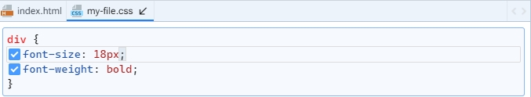

# Seleccion de bloque

La selección de un bloque CSS se lleva a cabo al hacer clic en el área del bloque. Un bloque seleccionado se puede identificar visualmente gracias al resaltado de su borde y fondo, además de una flecha junto al nombre de la pestaña a la que pertenece dicho bloque.

<figure><figcaption>
Selected CSS block
</figcaption></figure>

Cuando se selecciona un bloque CSS, implica que las acciones de los comandos sobrecargados de la barra de herramientas se aplicarán directamente a ese bloque. Los comandos sobrecargados se destacarán visualmente con un borde, resaltándolos sobre los comandos no sobrecargados.
