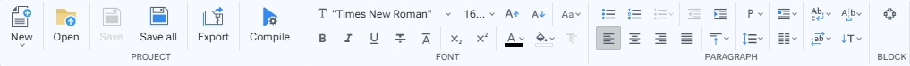
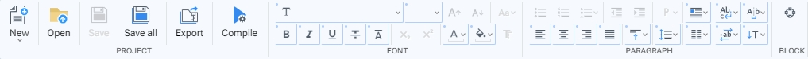

# Toolbars

Las barras de herramientas contienen botones asociados a comandos con acciones especificas. Estos botones pueden ejecutar acciones, desplegar menus de seleccion, cajas de edicion de valores y dialogos.

<figure><figcaption>
Toolbars
</figcaption></figure>

En CHEMISWEB Studio muchos comandos presentan una sobrecarga en su comportamiento, dependiendo de si en el Inspector de Hojas de Estilos está seleccionado un bloque. Los comandos sobrecargados tendran un borde visual que los resalte sobre los otros comandos.

<figure><figcaption>
Toolbars with commands overloaded
</figcaption></figure>

