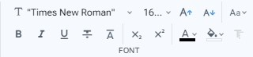
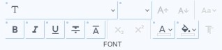

# Font toolbar

En la barra de herramientas **Font** encontrará comandos para modificar aspectos tipograficos de la seleccion presente en el documento. Si mantiene seleccionado un bloque en el **Inspector de Hojas de Estilos**, estos comandos modificaran directamente las declaraciones dentro del bloque en lugar de la seleccion del documento.&#x20;


Para conocer mas detalles del comportamiento sobrecargado de los comandos consulte la pagina **Seleccion de bloque y comandos sobrecargados**.


<figure><figcaption>
Font toolbar
</figcaption></figure>

 

<figure><figcaption>
Font toolbar with commands overloaded
</figcaption></figure>

### Comandos de la barra:

* **Font family**: Establece el nombre de fuente. Puede ademas desplegar el dialogo [Font settings dialog](../dialogs/font-settings-dialog.md) para la configuracion de otras opciones de fuente (font size, line height, font weight, ...). In overloaded mode, this command set "`font`" or "`font-family`" property in CSS selected block.
* **Font size**: Set the size of the font. You can select one option of the list, or enter a custom value.
* **Font size increment**: Increase in one the value of the font size.
* **Font size decrement**: Decrease in one the value of the font size.
* **Text transform**: Specify how to capitalize a text. It can be used to make text appear in all-uppercase or all-lowercase, invert case, sentece or with each word capitalized.
* **Bold**: Apply bold formatting.
* **Italic**: Apply italic formatting.
* **Underline**: Apply underline formatting.
* **Line through**: Apply the line format through the middle.
* **Overline**: Apply the line format above.
* **Subscript**: Specify inline text which should be displayed as subscript for solely typographical reasons. Subscripts are typically rendered with a lowered baseline using smaller text. Este comando no presenta sobrecarga.
* **Superscript**: Specify inline text which is to be displayed as superscript for solely typographical reasons. Superscripts are usually rendered with a raised baseline using smaller text.
* **Color**: Show a picker for select the color value of an element's text and text decorations. For more colors and options, open the [Color dialog](../dialogs/color-dialog.md) at the end of the picker.
* **Background color**: Show a picker for select the background color value. For more colors and options, open the [Color dialog](../dialogs/color-dialog.md) at the end of the picker.
