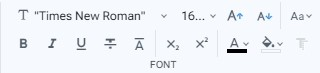

# Font

En la barra de herramientas Font encontrará varias opciones para personalizar el estilo y apariencia de la fuente de su texto. Puede ajustar el tipo de fuente y tamaño, convertir el texto a mayúsculas o minúsculas, capitalizar la primera letra de las palabras o de la oración, formato negrita, cursiva, subrayado, tachado, sobrescrito o subíndice. Además, también puede cambiar el color de la fuente y el color de fondo.&#x20;


Esta barra de herramientas contiene comandos sobrecargados, para conocer mas detalles puede consultar la pagina **Seleccion de bloque y comandos sobrecargados**.


<figure><figcaption>
Font toolbar
</figcaption></figure>

 

<figure><figcaption>
Font toolbar with commands overloaded
</figcaption></figure>

* **Font family**: Show a list of generic font family names. For select more fonts and options, open the [Font settings dialog](../dialogs/font-settings-dialog.md) at the end of the list.
* **Font size**: Set the size of the font. You can select one option of the list, or enter a custom value.
* **Font size increment**: Increase in one the value of the font size.
* **Font size decrement**: Decrease in one the value of the font size.
* **Text transform**: Specify how to capitalize a text. It can be used to make text appear in all-uppercase or all-lowercase, invert case, sentece or with each word capitalized.
* **Bold**: Apply bold formatting.
* **Italic**: Apply italic formatting.
* **Underline**: Apply underline formatting.
* **Line through**: Apply the line format through the middle.
* **Overline**: Apply the line format above.
* **Subscript**: Specify inline text which should be displayed as subscript for solely typographical reasons. Subscripts are typically rendered with a lowered baseline using smaller text.
* **Superscript**: Specify inline text which is to be displayed as superscript for solely typographical reasons. Superscripts are usually rendered with a raised baseline using smaller text.
* **Color**: Show a picker for select the color value of an element's text and text decorations. For more colors and options, open the [Color dialog](../dialogs/color-dialog.md) at the end of the picker.
* **Background color**: Show a picker for select the background color value. For more colors and options, open the [Color dialog](../dialogs/color-dialog.md) at the end of the picker.
