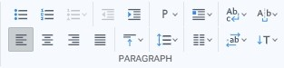
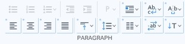

# Paragraph toolbar

La barra de herramientas Paragraph cuenta con una amplia variedad de comandos que permiten personalizar la apariencia de tus párrafos y bloques de texto. Algunos de los más comunes incluyen la posibilidad de alinear el texto a la izquierda, derecha, centrado o justificado, ajustar la sangría de la primera línea del párrafo, la sangría del párrafo completo o una combinación de ambas, modificar el espaciado entre líneas y el espaciado antes y después del párrafo, elegir un interlineado sencillo, doble o personalizado, establecer tabulaciones para crear columnas en el documento y crear listas con viñetas o numeradas.


Esta barra de herramientas contiene comandos sobrecargados, para conocer mas detalles puede consultar la pagina **Seleccion de bloque y comandos sobrecargados**.


<figure><figcaption>
Paragraph toolbar
</figcaption></figure>

 

<figure><figcaption>
Paragraph toolbar with commands overloaded
</figcaption></figure>

### **Ccomandos de la barra:**

* **Unordered list**: Create an unordered list of items, typically rendered as a bulleted list.
* **Ordered list**: Create an ordered list of items, typically rendered as a numbered list.
* **List type**: Change the type of the list.
* **Indent decrease**: Move the paragraph to the right of the margin.
* **Indent increase**: Move the paragraph to the left of the margin.
* **Align left**: Set the inline-level content aligned to the left edge of the element or table-cell box.
* **Align center**: Set the inline-level content aligned to the center of the element or table-cell box.
* **Align right**: Set the inline-level content aligned to the right edge of the element or table-cell box.
* **Justify content**: Set the inline-level content justified. Text should be spaced to line up its left and right edges to the left and right edges of the line box, except for the last line.
* **Vertical align**: Show a menu list that allows you to select one option or enter a custom value to set vertical alignment for an inline, inline-block, or table-cell box.
* **Paragraph level**: Show a menu list that allows you to change the selected element in a different types of elements, such as headings of different levels (H1 to H6) , blockquote, paragraph or div.
* **Line height**: Show a menu list that allows you to select one option or enter a custom value to set height of a line box.
* **Float**: Show a menu list that allows you to select a value and places the selected element on the left or right side of its container, allowing text and inline elements to wrap around it. Also, it contains a sub-menu list for the **Clear** property and its values.
* **Columns**: Show a menu list that allows you to select a number of columns. For set more columns and options, open the Columns generator dialog at the end of the list.
* **Flow control**: Show a menu list with sub-menus for the properties White space, Word break, Line break and Text overflow. These properties are used to manage how text is displayed within an element, including whitespace handling, how lines of text are broken, and how text overflow is handled.
* **Spacing and indentation**: Show a menu list with sub-menus for the properties Word spacing, Letter spacing and Text indent. These properties are used to control the spacing between words and letters, and the indentation of text.
* **Direction**: Show a menu list that allows you to change the direction of text, table columns, and horizontal overflow.
* **Orientation and writing mode**: Show a menu list with sub-menus for the properties Text orientation and Writing mode. These properties are used to control the orientation of characters and the direction in which lines of text are laid out.
