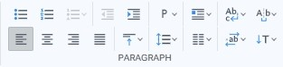

# Paragraph

La barra de herramientas Paragraph cuenta con una amplia variedad de comandos que permiten personalizar la apariencia de tus párrafos y bloques de texto. Algunos de los más comunes incluyen la posibilidad de alinear el texto a la izquierda, derecha, centrado o justificado, ajustar la sangría de la primera línea del párrafo, la sangría del párrafo completo o una combinación de ambas, modificar el espaciado entre líneas y el espaciado antes y después del párrafo, elegir un interlineado sencillo, doble o personalizado, establecer tabulaciones para crear columnas en el documento y crear listas con viñetas o numeradas.


Esta barra de herramientas contiene comandos sobrecargados, para conocer mas detalles puede consultar la pagina **Seleccion de bloque y comandos sobrecargados**.


<figure><figcaption>
Paragraph toolbar
</figcaption></figure>

 

<figure><figcaption>
Paragraph toolbar with commands overloaded
</figcaption></figure>

* **Unordered list**: Create an unordered list of items, typically rendered as a bulleted list.
* **Ordered list**: Create an ordered list of items, typically rendered as a numbered list.
* **List type**: Change the type of the list.
* **Indent decrease**: Move the paragraph to the right of the margin.
* **Indent increase**: Move the paragraph to the left of the margin.
* **Paragraph level**: Show a list that allow you change the selected element in a different types of elements, such as headings of different levels (H1 to H6) , blockquote, paragraph or div.
* **Float**: Show a list that allow you select a value and places the selected element on the left or right side of its container, allowing text and inline elements to wrap around it. Also, it contains a sub-list for the **Clear** property and its values.
*
